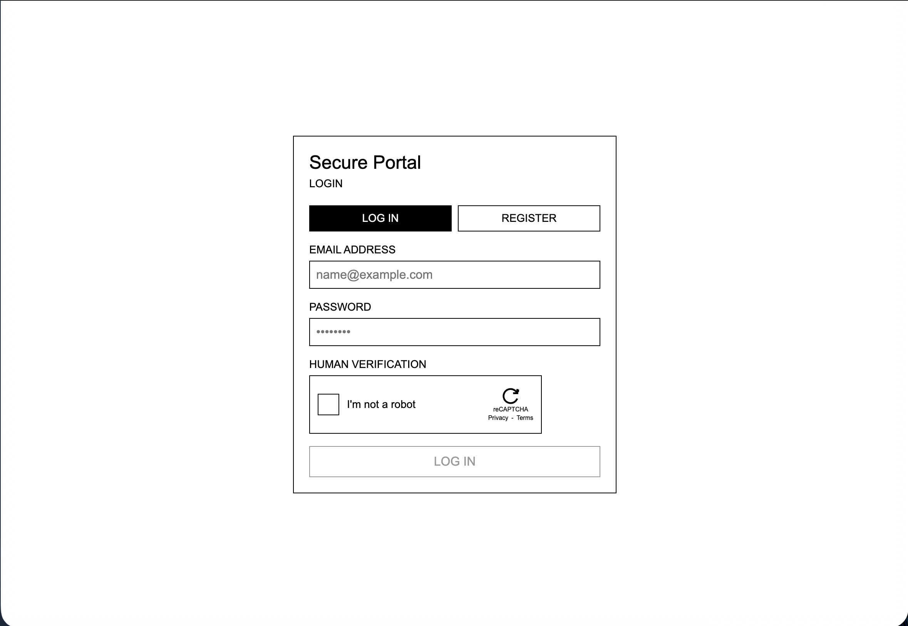
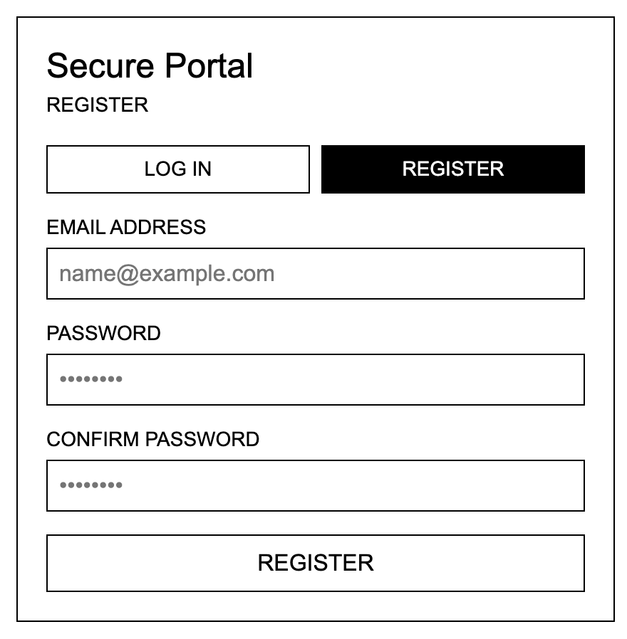
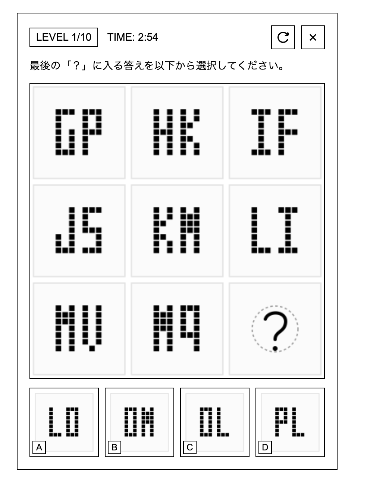
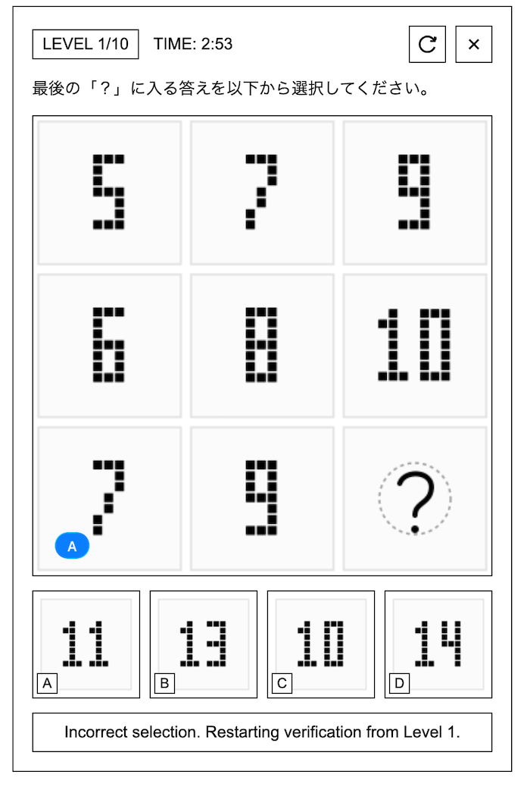
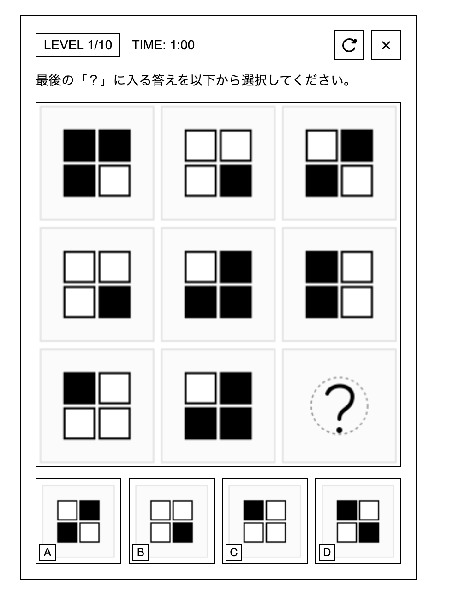
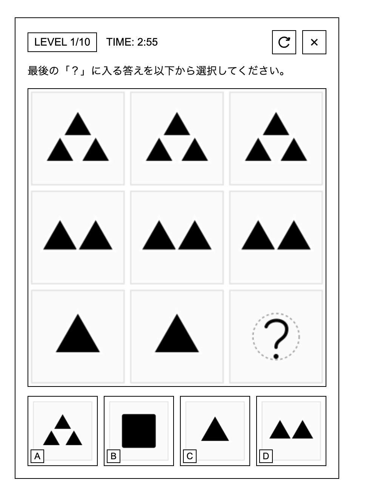
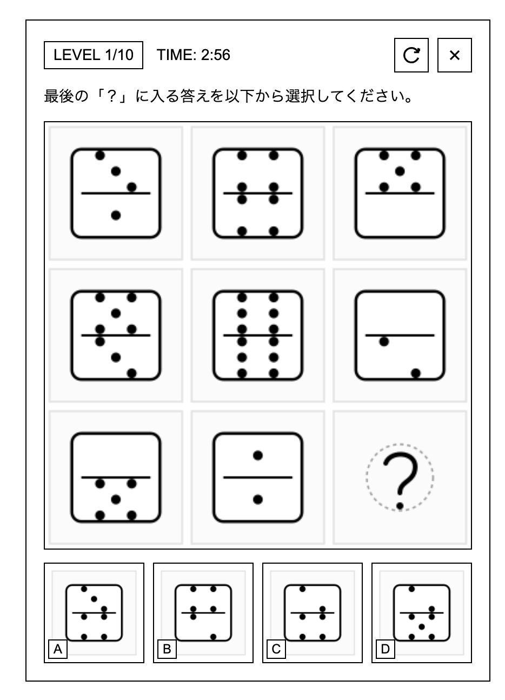
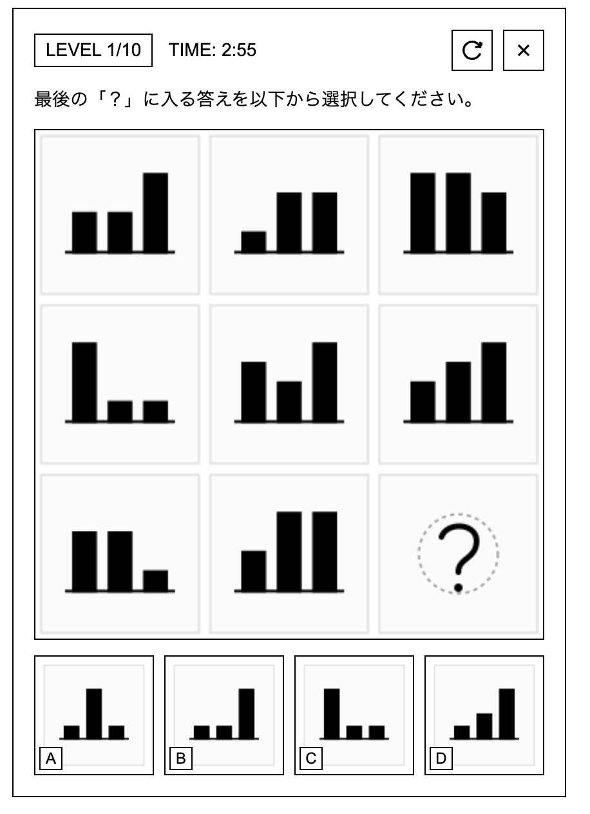
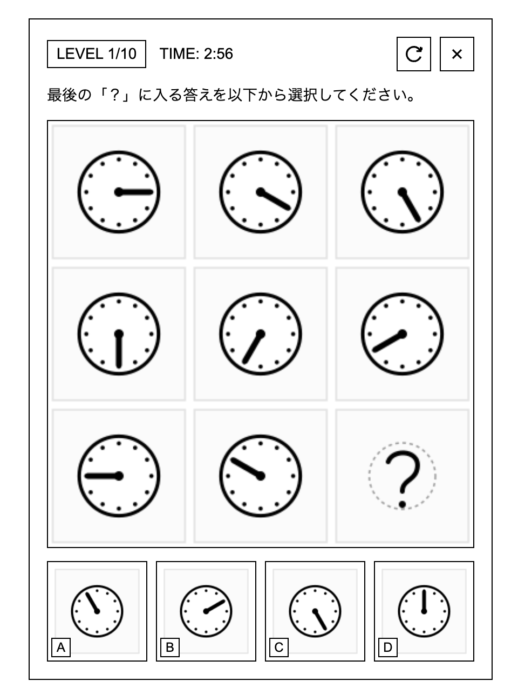

# 作業時間 日時
2026/06/15 - 2026/06/30  総作業時間 : 20時間

# Secure Portal CAPTCHA App
### URL : https://captcha-two-tan.vercel.app
**セッションベース認証** と **認可機能** を備えたNext.jsウェブアプリです。

ログインにはSupabase上のユーザー情報を使用し、パスワードはbcryptでハッシュ化して保存します。ログイン前にはIQテスト風CAPTCHAを10問クリアする必要があります。

<p align="center">
  
</p>

## 課題要件との対応

| 課題要件 | このアプリでの実装 |
| --- | --- |
| Next.jsで実装 | Next.js App Routerで実装 |
| トークンベース認証またはセッションベース認証 | セッションベース認証を採用 |
| 認証機能 | Supabaseに保存したユーザー情報でログイン |
| 認可機能 | 未ログイン状態では `/congratulations` にアクセスできず、トップページへリダイレクト |
| 教材にない認証・認可関連機能を2つ以上 | CAPTCHA、確認用パスワード、メール重複チェック、bcrypt保存を実装 |
| GitHub Publicリポジトリ提出 | このリポジトリをPublicにしてURLを提出 |

## 実装した認証・認可機能

### 1. セッションベース認証

ログイン成功時に、サーバー側で署名付きセッショントークンを作成し、HttpOnly Cookieに保存します。

- Cookie名: `secure_portal_session`
- Cookie属性: `httpOnly`, `sameSite: lax`
- セッション有効期限: 1時間
- セッション検証: [src/lib/auth/session.ts](./src/lib/auth/session.ts)

保護ページ `/congratulations` ではCookie内のセッションを検証し、無効な場合は `/` にリダイレクトします。

関連ファイル:

- [src/app/api/login/route.ts](./src/app/api/login/route.ts)
- [src/lib/auth/session.ts](./src/lib/auth/session.ts)
- [src/app/congratulations/page.tsx](./src/app/congratulations/page.tsx)

### 2. Supabaseを使ったユーザー登録・ログイン

ユーザー情報はSupabaseの `app_users` テーブルに保存します。ログイン時は固定値判定ではなく、Supabaseから取得したユーザーのパスワードハッシュと照合します。

関連ファイル:

- [src/lib/auth/users.ts](./src/lib/auth/users.ts)
- [src/app/api/register/route.ts](./src/app/api/register/route.ts)
- [src/app/api/login/route.ts](./src/app/api/login/route.ts)
- [supabase/schema.sql](./supabase/schema.sql)

### 3. bcryptによるパスワードハッシュ保存

登録時に平文パスワードは保存せず、`bcryptjs` でハッシュ化した値のみをSupabaseに保存します。

```ts
const passwordHash = await bcrypt.hash(password, BCRYPT_ROUNDS);
```

ログイン時は `bcrypt.compare()` で照合します。

```ts
const isValid = await bcrypt.compare(password, data.password_hash);
```

### 4. サインアップ時の確認用パスワード

登録画面では `PASSWORD` と `CONFIRM PASSWORD` の2つを入力し、一致しない場合は登録APIを呼ばずにエラーを表示します。

<p align="center">
  
</p>

関連ファイル:

- [src/app/page.tsx](./src/app/page.tsx)

### 5. メールアドレスの重複チェック

Supabaseの `email` カラムに `unique` 制約を付けています。同じメールアドレスで登録しようとした場合は、`This email is already registered.` を返します。

```sql
email text not null unique
```

> 画像挿入推奨: 重複メール登録時のエラー表示スクリーンショットを追加してください。  
> 例: `docs/images/duplicate-email-error.png`

### 6. CAPTCHAによるbot対策

ログイン前に10問連続のIQテスト風CAPTCHAをクリアする必要があります。CAPTCHAを最後までクリアすると、ログインAPIに送信するためのCAPTCHA証明トークンが発行されます。

CAPTCHAには以下のような問題タイプがあります。

- 図形パターン
- 数列
- 文字列パターン
- ドミノ風パターン
- タイル反転パターン
- 時計・棒グラフ系パターン

<p align="center">
  
  
</p>
<p align="center">
  
  
</p>
<p align="center">
  
  
</p>
<p align="center">
  
</p>

CAPTCHAトークンは1回使い切りです。不正解、早すぎる回答、正解のいずれでも同じ問題トークンは再利用できません。

関連ファイル:

- [src/components/Captcha/Captcha.tsx](./src/components/Captcha/Captcha.tsx)
- [src/app/api/captcha/generate/route.ts](./src/app/api/captcha/generate/route.ts)
- [src/app/api/captcha/verify/route.ts](./src/app/api/captcha/verify/route.ts)
- [src/lib/captcha/generator.ts](./src/lib/captcha/generator.ts)
- [src/lib/captcha/crypto.ts](./src/lib/captcha/crypto.ts)

## 認証フロー

### サインアップ

1. ユーザーが `REGISTER` 画面を開く。
2. メールアドレス、パスワード、確認用パスワードを入力する。
3. 確認用パスワードが一致するかフロントエンドで確認する。
4. `/api/register` に登録リクエストを送信する。
5. サーバー側でメール形式とパスワード長を検証する。
6. bcryptでパスワードをハッシュ化する。
7. Supabaseの `app_users` テーブルに保存する。
8. メールアドレスが重複している場合は登録を拒否する。

### ログイン

1. ユーザーがメールアドレスとパスワードを入力する。
2. CAPTCHAを10問クリアする。
3. CAPTCHA証明トークンが発行される。
4. `/api/login` にログインリクエストを送信する。
5. Supabaseからユーザーを取得する。
6. bcryptでパスワードを照合する。
7. CAPTCHA証明トークンを検証する。
8. 成功時にHttpOnly Cookieへセッショントークンを保存する。
9. `/congratulations` に遷移する。

<p align="center">
  
</p>

## 使用技術

- Next.js 16
- React 19
- TypeScript
- Supabase
- bcryptjs
- sharp

## Supabaseセットアップ

SupabaseのSQL Editorで [supabase/schema.sql](./supabase/schema.sql) を実行します。

```sql
create extension if not exists pgcrypto;

create table if not exists public.app_users (
  id uuid primary key default gen_random_uuid(),
  email text not null unique,
  password_hash text not null,
  created_at timestamptz not null default now()
);

alter table public.app_users enable row level security;

revoke all on table public.app_users from anon;
revoke all on table public.app_users from authenticated;
```

`SUPABASE_SERVICE_ROLE_KEY` を使うサーバー側Route Handlerからのみ操作するため、`anon` と `authenticated` からの直接アクセスは無効化しています。

## 環境変数

ローカルでは `.env.local`、VercelではEnvironment Variablesに以下を設定します。

```env
SUPABASE_URL=https://your-project.supabase.co
SUPABASE_SERVICE_ROLE_KEY=your-service-role-key
SESSION_SECRET=replace-with-a-long-random-string
CAPTCHA_SECRET=replace-with-a-long-random-string
```

注意:

- `SUPABASE_SERVICE_ROLE_KEY` は秘密鍵です。
- Client Componentでは使用しません。
- `NEXT_PUBLIC_` を付けて公開しません。
- GitHubには `.env.local` をコミットしません。

## ローカル実行方法

依存関係をインストールします。

```bash
npm install
```

開発サーバーを起動します。

```bash
npm run dev
```

ブラウザで以下を開きます。

```text
http://localhost:3000
```

## 使い方

1. `REGISTER` に切り替える。
2. メールアドレス、パスワード、確認用パスワードを入力して登録する。
3. `LOG IN` に戻る。
4. メールアドレスとパスワードを入力する。
5. reCAPTCHA風チェックボックスを押す。
6. CAPTCHAを10問クリアする。
7. `LOG IN` を押す。
8. 認証成功後、`/congratulations` に遷移する。

## Vercelデプロイ時の注意

VercelではローカルファイルをDB代わりに使えないため、ユーザー情報はSupabaseに保存しています。

Vercelにデプロイする前に、Project SettingsのEnvironment Variablesに以下を登録してください。

- `SUPABASE_URL`
- `SUPABASE_SERVICE_ROLE_KEY`
- `SESSION_SECRET`
- `CAPTCHA_SECRET`

## 動作確認コマンド

```bash
npm run lint
npm run build
```

## 画像を追加する場合

READMEに画像を入れる場合は、以下のような構成がおすすめです。

```text
docs/
  images/
    login-screen.png
    register-screen.png
    duplicate-email-error.png
    captcha-modal.png
    congratulations-page.png
```

Markdownには以下のように挿入できます。

```md

```

## 提出

このGitHubリポジトリをPublicに設定し、リポジトリURLをTeamsに提出します。
